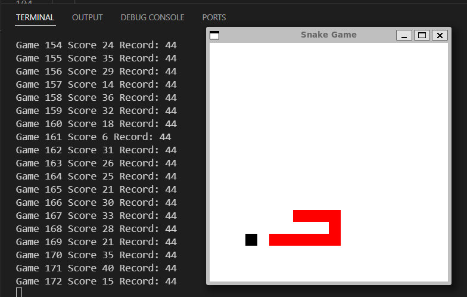

Code for CS4900 PA1.

Source for original Snake implementation & AI can be found [here](https://github.com/sourenaKhanzadeh/snakeAi).

To run, follow instructions as per the link above, or simply:
1. cd snakeAi-master
2. pip install -r requirements.txt
3. python main\.py

WandB Page can be found [here](https://wandb.ai/nickadkins47/CS-4900-PA1).

Here is a gif of run "sweet-frost-2" running:

